## window server 2003 enterprise edition下载

百度网盘链接：https://pan.baidu.com/s/1R3Q-cf9n0t1MqKaF7WBWGA?pwd=5mia 
提取码：5mia

<!--more-->
## 搭建步骤

1、用vmware创建虚拟机，没什么值得注意的地方，正常安装就行

2、安装好虚拟机后按步骤来
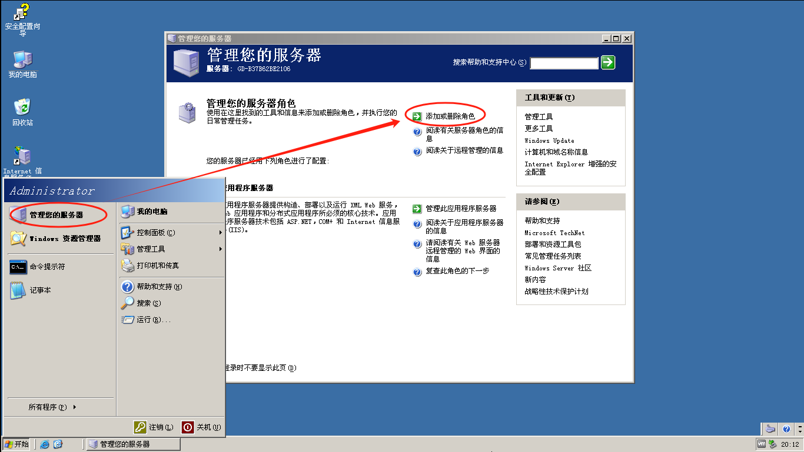
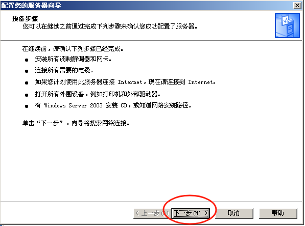
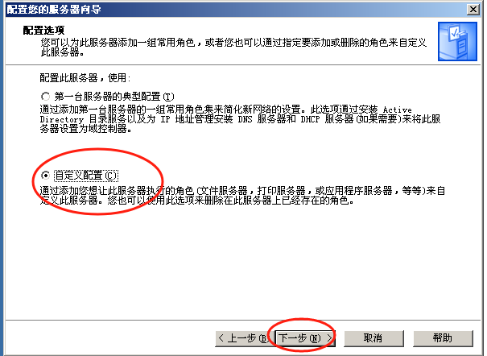
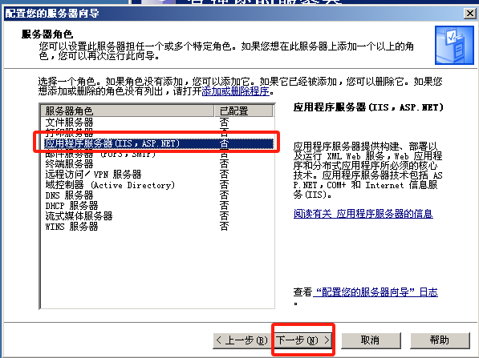
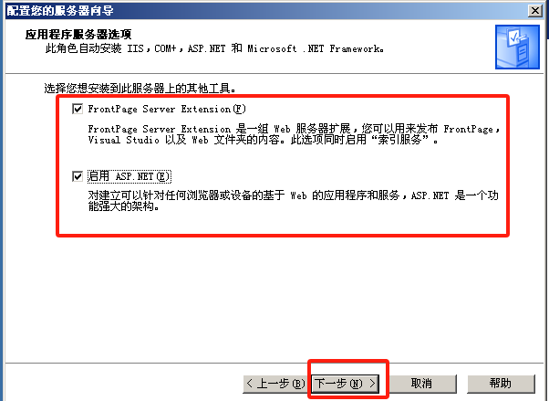
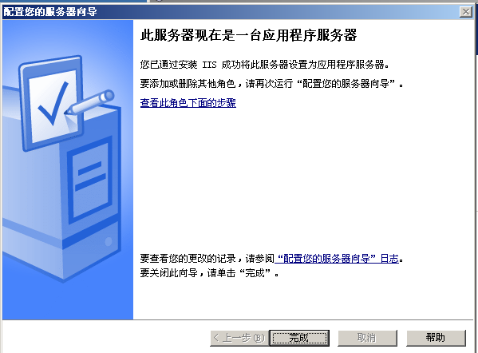
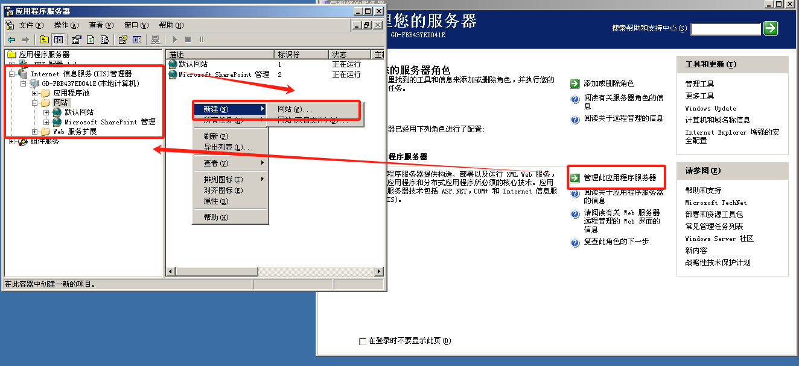
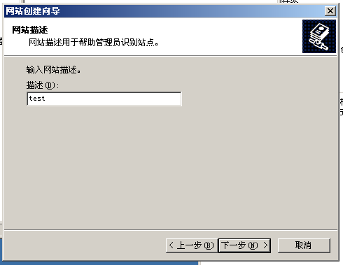
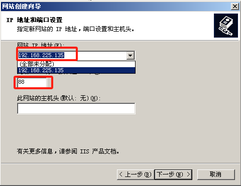
 

3、创建一个文件夹以放置文件，路径就是文件夹的路径
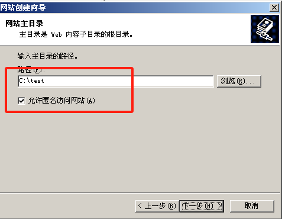
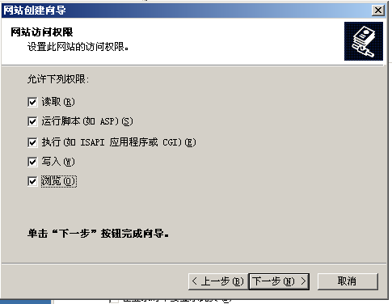
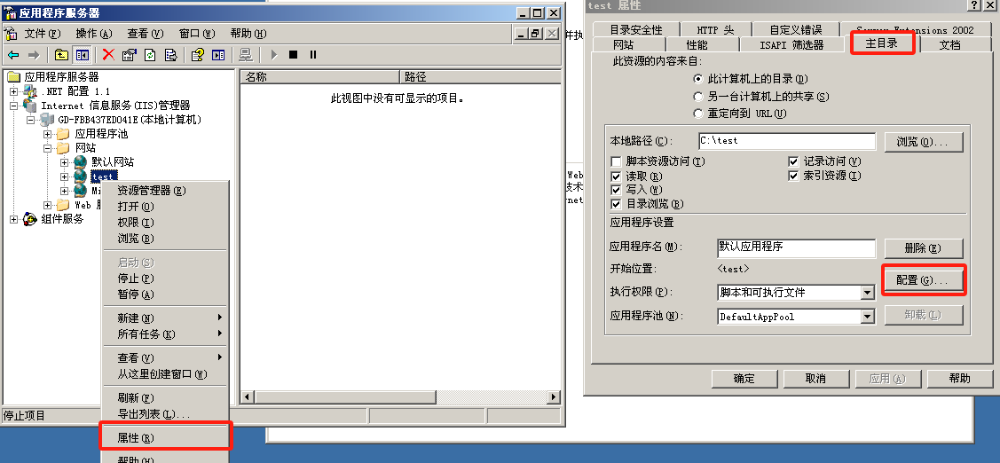
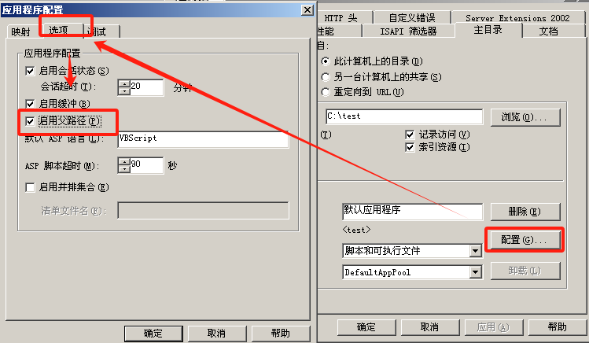
 

4、打开test文件夹，创建一个index文本文件，随便输入并保存，记得把最后把后缀名改为html
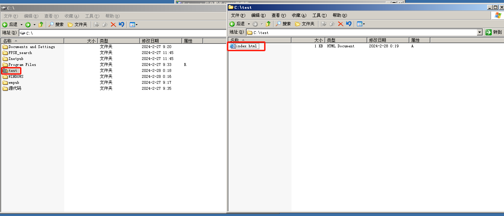
 

5、右键test，把权限打开，防止网站无法访问，如果还是无法访问，那么把IIS管理器内web服务扩展里的权限也打开
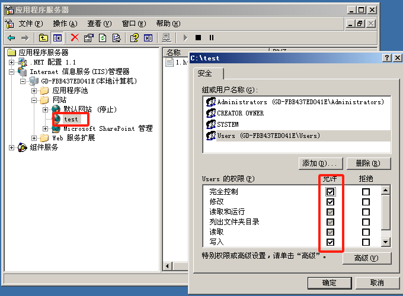
 

6、可以看到网站已经可以打开了
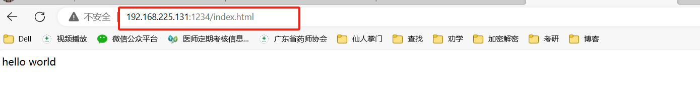
 

7、一般我们使用win2003是为了用源码搭建靶场的，如果有源码在手，我们可以在第三步时就将路径设为源码的文件夹（注意：不是下图这里更改，这里只是作演示）
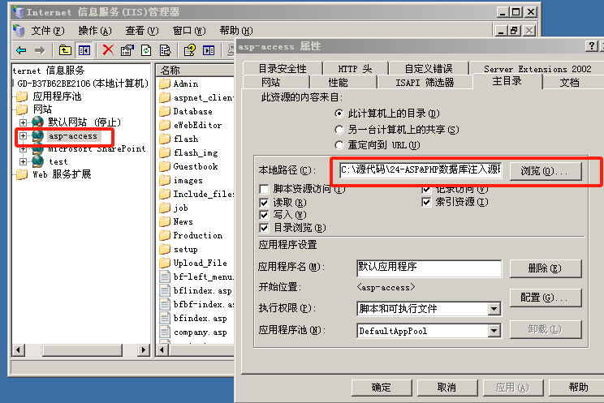
 

8、如果在访问网站时需要验证时,可以在用户组里创建一个用户以进行验证并访问网站(我已经验证过了所以没有弹出框可以截出来)
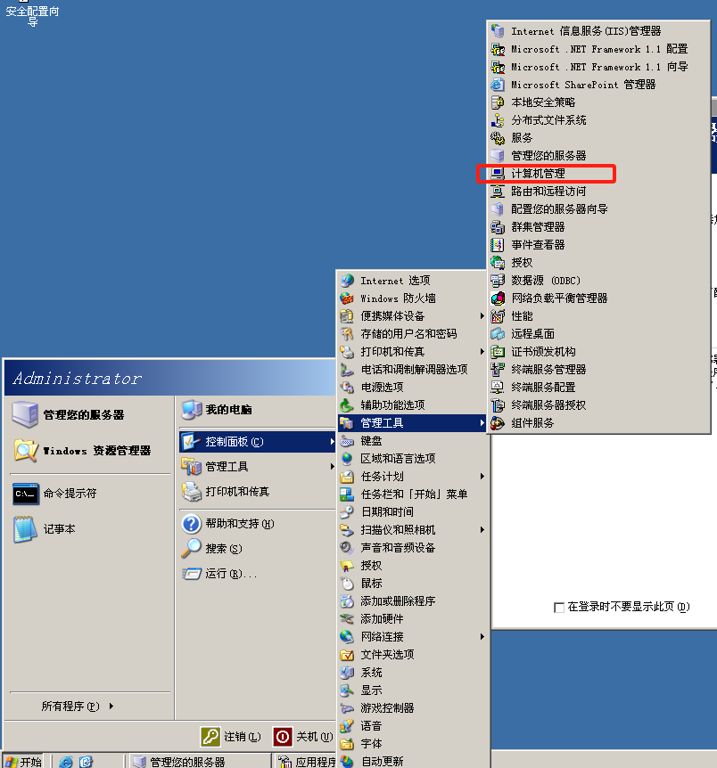
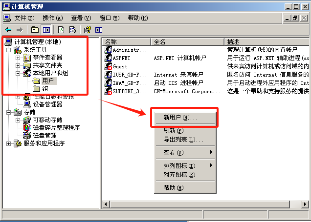
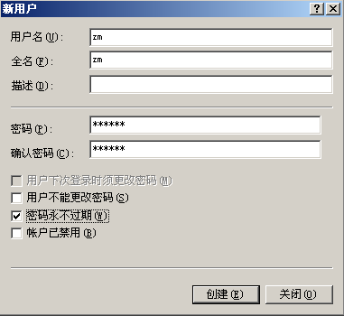