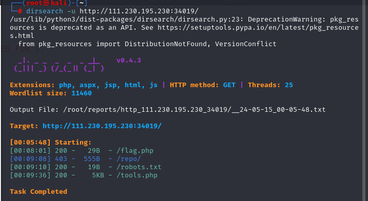

# web-代码执行

## RCE你会吗？？
1、打开网站看到提示我们进行目录扫描


2、使用dirsearch进行扫描，得到四个结果，进入flag.php毫不意外是假的flag，进入robots.txt,得到提示：tools.php



3、进入源代码，进行初步审计，发现第一个考点是php死亡函数绕过


```
if(isset($_GET['file'])||$_GET['content']){
    $d   = '<?php die("nononon");?>'; // phpdienononon
    $a= $d. $_GET['content'];
    @file_put_contents($_GET['file'],$a);
}
```

4、这里使用base64绕过，**关键知识点：**base64编码中只包含64个可打印字符，而PHP在解码base64时，遇到不在其中的字符时，将会跳过这些字符，仅将合法字符组成一个新的字符串进行解码。我们将使用`php://filter/write=convert.base64-decode` 来对其解码并写入文件，由于$d内的< ? " () ; >不在base64编码范围内，因此解码时只会解码phpdienononon和我们传入的字符串。

5、而phpdienononon长度为13，base64算法解码时是4个byte一组，所以我们要补三个字符到其后面，构造payload进行执行


6、打开我们刚刚写入的php文件，POST命令执行，直到获取flag


一般来说rce，可能一开始很多人都会看到这个shell_exec，但是这里过滤的严格，很难代码执行，所以这个地方是个迷惑选手的地方，主要是想考如何绕过die函数来写入文件，达到rce。
<br>

# web-文件上传


# web-php反序列化

## [0CTF 2016]piapiapia 1