## 方法一：

<!--more-->

1、查看kali虚拟机的IP，打开cobalt strike 进行连接
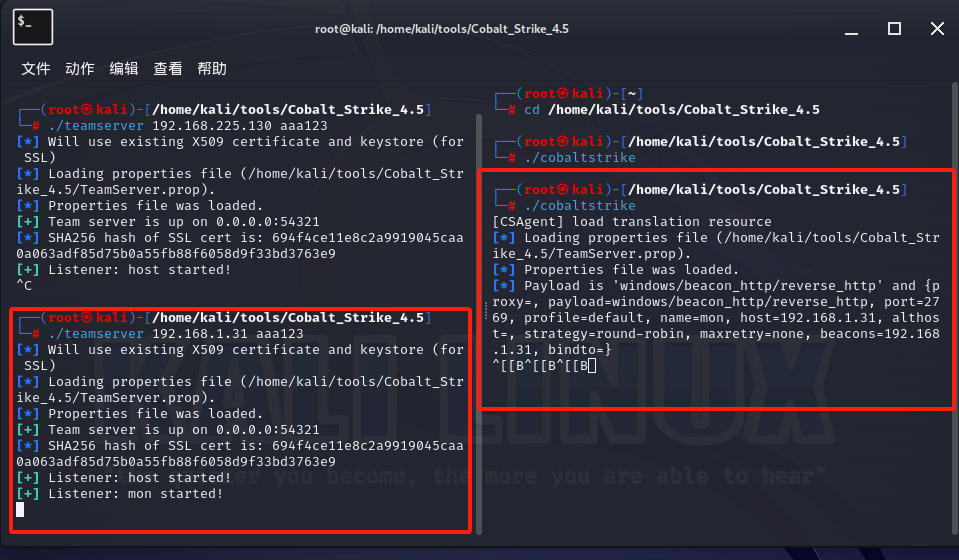
 

2、把生成的后门exe文件放到root下
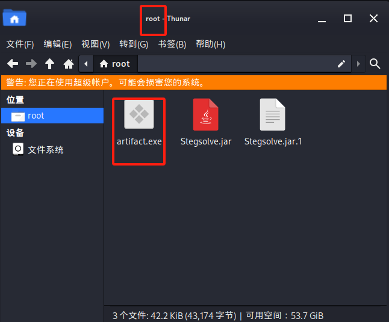
 

3、输入以下命令以开启python服务，在kali里打开浏览器输入“127.0.0.1：端口号”或者“kali的IP ： 端口号”，验证网站是否能打开并存在后门文件。 
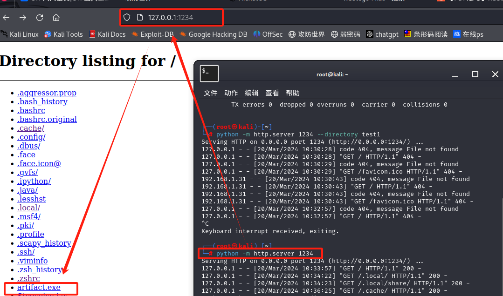
 

4、在本机上打开网站并下载文件（先把病毒查杀关闭）
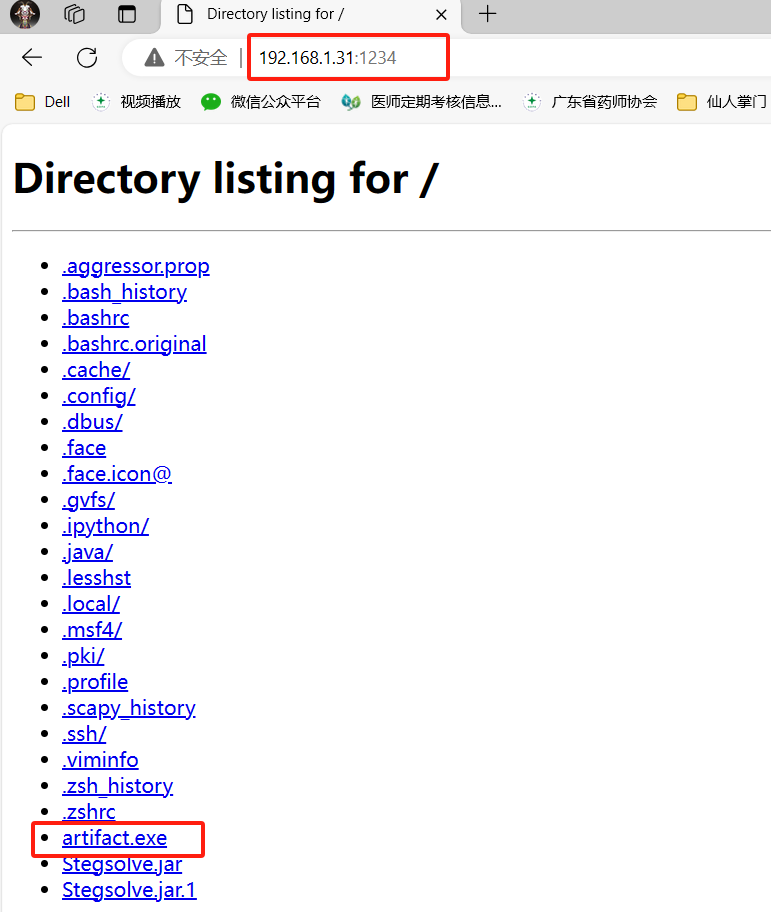
 

5、下载打开后可以在kali里看到已经有一个监视窗口了，我们可以对其进行操作
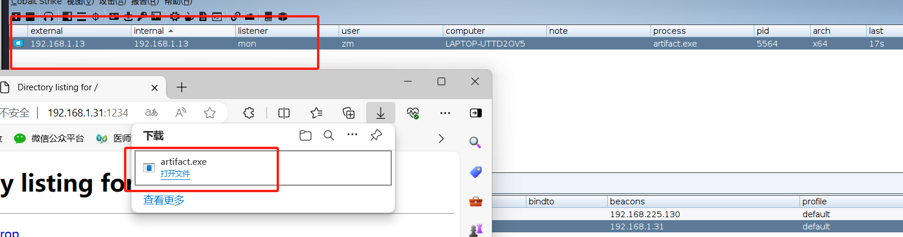

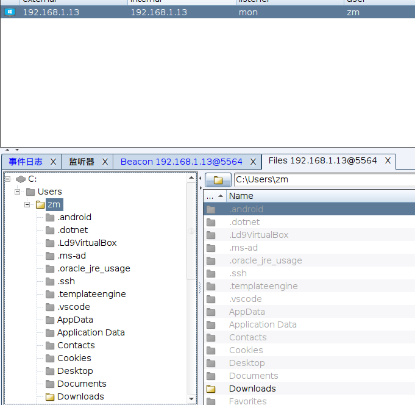
 

6、输入以下命令开启apache服务，在etc/apache2/ports.conf 里查看启用的端口号
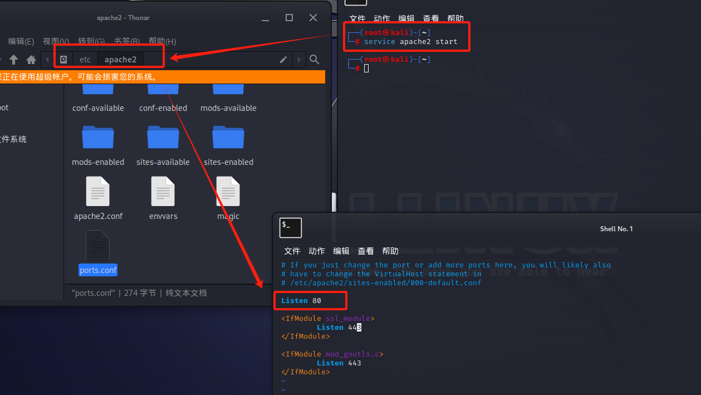
 

7、输入 “IP地址：端口号” 就可以看到服务已经成功启动了
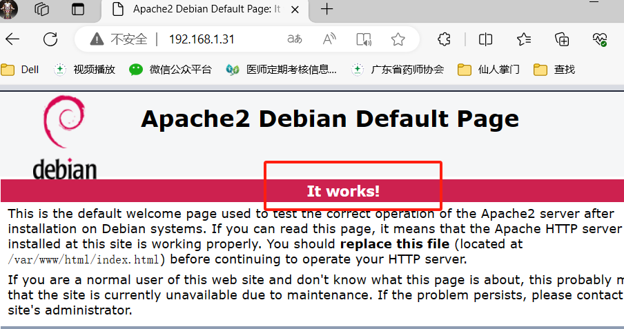
 

8、将var/www/html内的index.html 移除，把后门文件复制到文件夹内，打开网站后可以看到文件的存在。
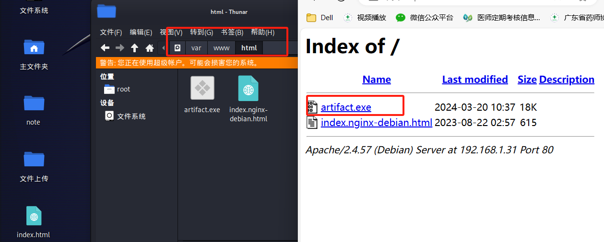
 

## 方法二：

1、在cobalt strike内打开文件托管
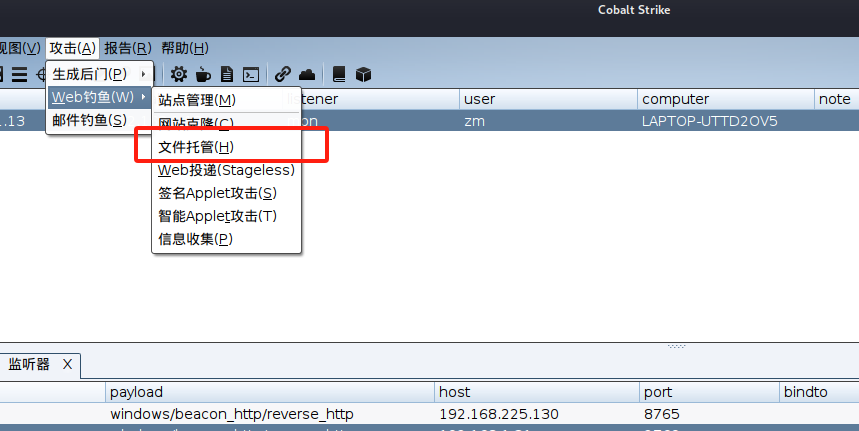
 

2、输入相应的信息，运行文件托管，成功后复制URL到本机浏览器打开
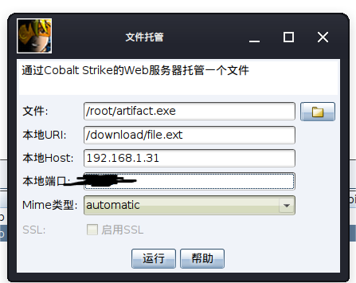

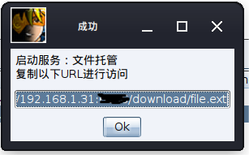
 

3、下载文件后将文件后缀改回exe即可运行并连接cobalt strike。
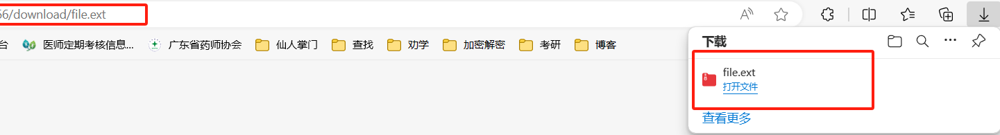