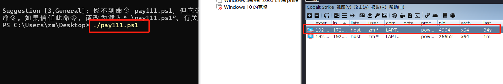

## 方法一：使用powershell进行免杀

<!--more-->

1、首先改变window的文件执行策略，并关闭window内的病毒实时查杀

 

2、打开kali内的cobalt strike ，生成payload后门，注意输出格式为powershell

 

3、使用文件托管进行文件传输

 

4、使用本机打开网站，并将里面的内容复制到文本文档内

 

5、另存为文件，注意保存类型和文件后缀，后缀名为ps1，是数字1

 

6、在powershell内输入以下代码，执行文件，可以在kali的监听器内发现本机

 

## 方法二： 使用invoke-obfuscation进行免杀

1、首先在github下载invoke-obfuscation的压缩包

 

2、解压后定位到文件夹内依次输入
import-module ./invoke-obfuscation.psd1
Invoke-obfuscation
以运行软件

 

3、输入“set scriptpath 需要混淆的文件的地址”

 

4、输入encoding选择编码进行混淆，在1~8的编码方式中进行选择
（这里使用第一个ASCII编码发现无法避免window查杀，后来测试第五个AES加密可以实现免杀）

 

5、输入“out 存放混淆后的文件的地址”，得到文件

 

6、在powershell里执行文件可以看到kali的监听器已经发现了本机

 

7、将window的病毒实时查杀打开后，再打开未进行混淆的pay.ps1，发现该文件已经被window杀掉了。

 

8、而进行混淆后的pay111.ps1还可以运行。

 