## cobaltstrike_4.5 汉化版下载

百度网盘链接：https://pan.baidu.com/s/17XNlDkZeahIBiGj2QzSJAQ?pwd=wq46 
提取码：wq46

<!--more-->

## cobaltstrike使用流程

1、首先下载压缩包并解压到随便一个文件夹。
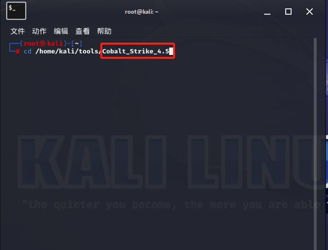
 

2、ls查看文件，并给cobaltstrike和teamserver执行权限。  
（注：每一种所有对象都有三种权限：r:读、w:写、x:执行）  
在赋予权限后ls查看文件可以看到cobaltstrike和teamserver的颜色由白色变到青色。
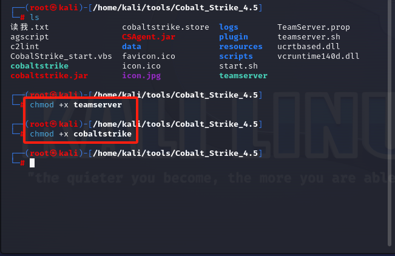
 

3、输入如图指令运行团队服务器，红框中的是kali虚拟机上的ip地址，黄色涂鸦部分是你想要设置的团队服务器密码，留意端口号“54321”。
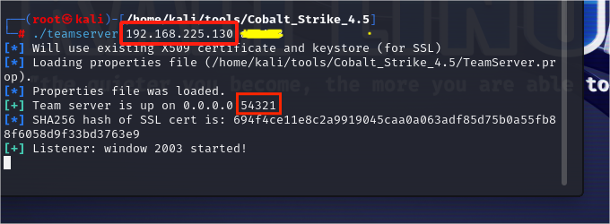
 

4、在另外一个root命令框中输入 `./cobaltstrike` 以启动客户端。  
输入第三步红框中的数据进行连接，这时候会出现指纹校验对话框，点击确定即可。
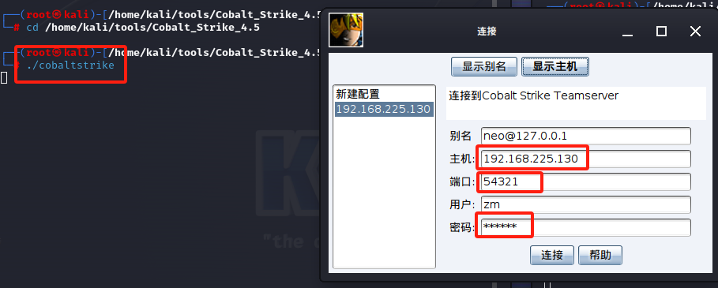
 

5、如图所示打开监听器，并进行设置。
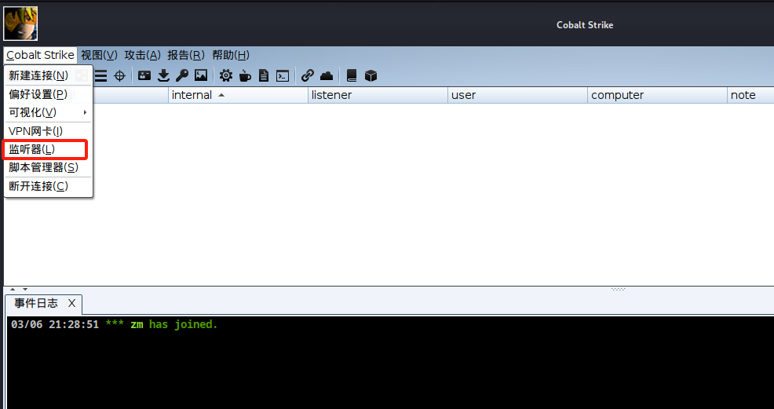

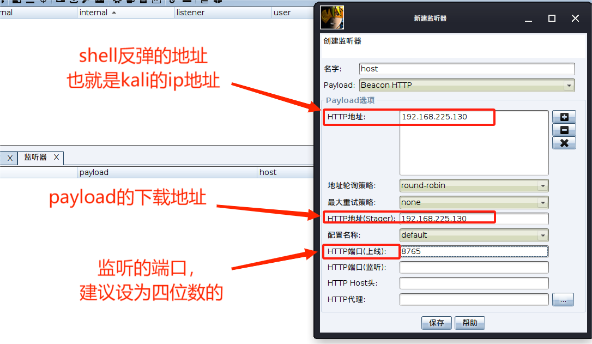
 

6、在菜单栏上选择攻击-生成后门-可执行程序，选择监视器后生成exe文件，将文件保存在自己好找的地方即可。
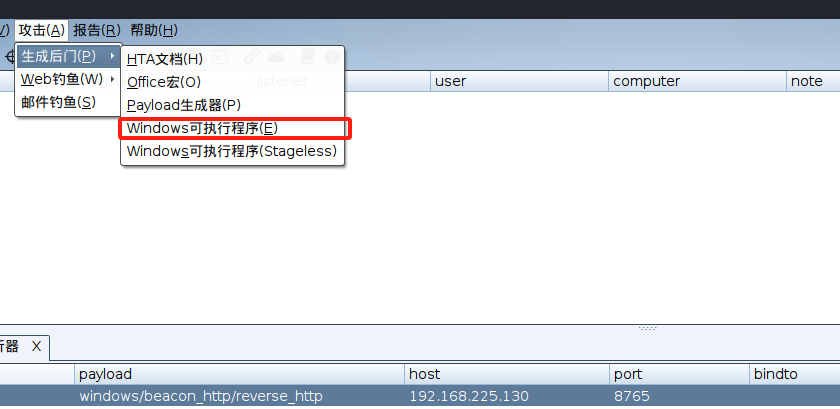

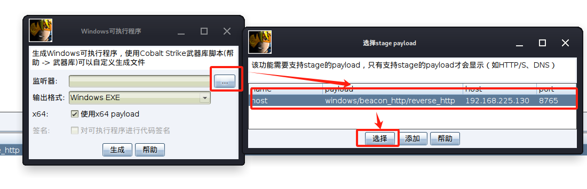

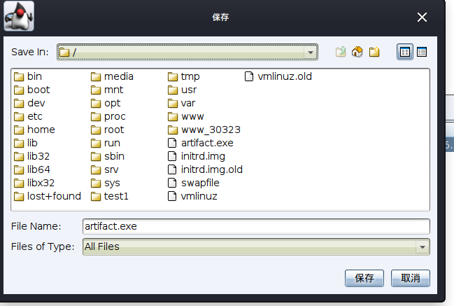

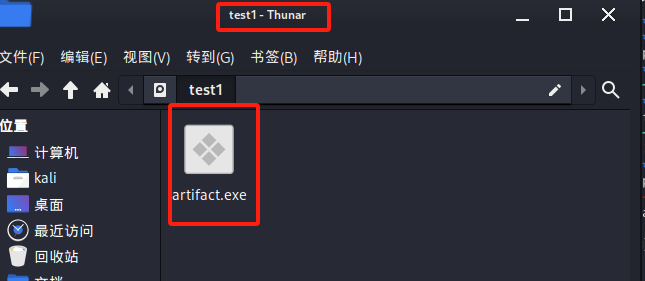
 

7、在实验的目标靶机上关闭实时保护，防止木马被杀掉。
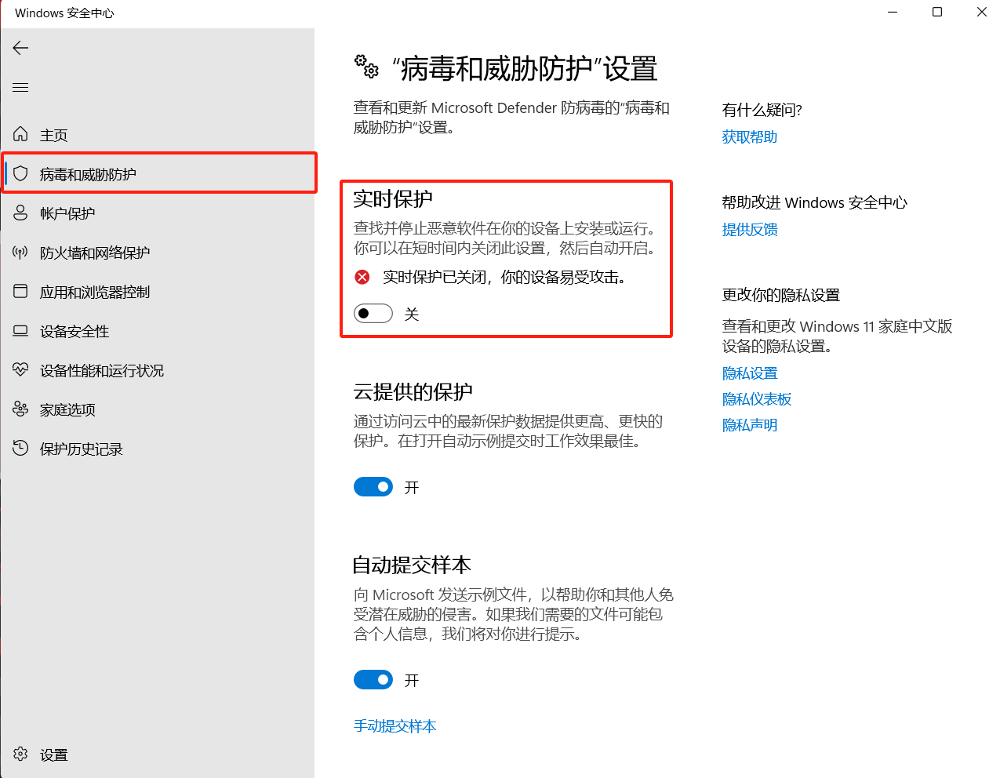
 

8、当靶机点击exe文件后，目标列表会新增一位。
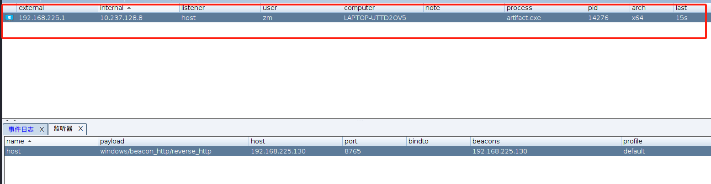
 

9、单击右键目标靶机，设置回连间隔为0，以实时查看kali对靶机的操作。
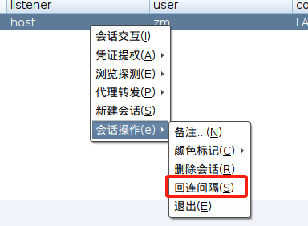
 

10、以下是两个简单的操作。值得注意的是：在执行命令时，需要在命令前添加”shell”
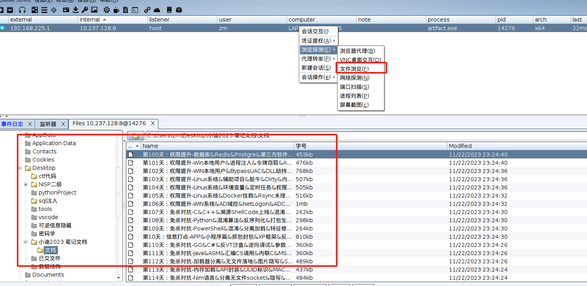
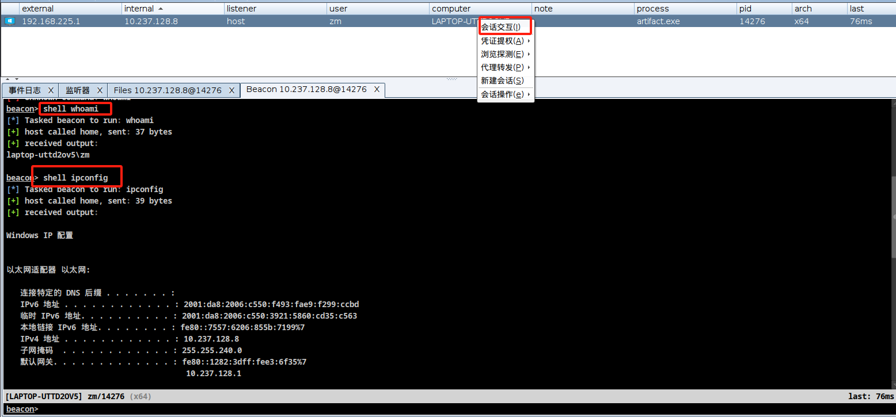
