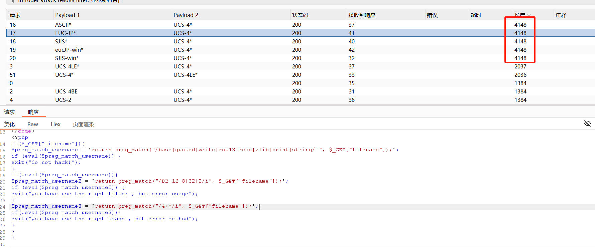

## 文件包含概述
文件包含漏洞是一种常见的 Web 应用程序安全漏洞，是代码注入的一种。它的本质是允许攻击者通过利用应用程序中存在的文件包含功能，向服务器提交恶意代码并执行。文件包含漏洞的发生通常与开发人员未对用户提供的文件路径进行足够验证和过滤有关。  
<!--more-->

以PHP为例,常用的文件包含函数有以下四种：  
**require()**:找不到被包含的文件会产生致命错误，并停止脚本运行  
**include()**:找不到被包含的文件只会产生警告，脚本继续执行  
**require_once()**与require()类似:唯一的区别是如果该文件的代码已经被包含，则不会再次包含  
**include_once()**与include()类似:唯一的区别是如果该文件的代码已经被包含，则不会再次包含  
<br>

## PHP伪协议
常见伪协议：
```
file:// — 访问本地文件系统
http:// — 访问 HTTP(s) 网址
ftp:// — 访问 FTP(s) URLs
php:// — 访问各个输入/输出流（I/O streams）
zlib:// — 压缩流
data:// — 数据（RFC 2397）
glob:// — 查找匹配的文件路径模式
phar:// — PHP 归档
ssh2:// — Secure Shell 2
rar:// — RAR
ogg:// — 音频流
expect:// — 处理交互式的流
```

关于php://filter ，可以参考`https://www.anquanke.com/post/id/202510#h3-9`  ，写的很详细
<br>

## 本地文件包含漏洞（LFI）
当一个Web应用程序接收到用户输入并将其作为文件路径来包含文件时，如果没有进行适当的验证和清理，就可能被攻击者利用来访问或包含服务器上的其他文件。

一些常见的敏感目录信息路径:  
**Windows系统:**

C:\boot.ini //查看系统版本  
C:\windows\system32\inetsrv\MetaBase.xml //IIS配置文件  
C:\windows\repair\sam //存储Windows系统初次安装的密码  
C:\ProgramFiles\mysql\my.ini //Mysql配置  
C:\ProgramFiles\mysql\data\mysql\user.MYD //MySQL root密码  
C:\windows\php.ini //php配置信息  

**Linux/Unix系统:**  
/etc/password //账户信息  
/etc/shadow //账户密码信息  
/usr/local/app/apache2/conf/httpd.conf //Apache2默认配置文件  
/usr/local/app/apache2/conf/extra/httpd-vhost.conf //虚拟网站配置  
/usr/local/app/php5/lib/php.ini //PHP相关配置  
/etc/httpd/conf/httpd.conf //Apache配置文件  
/etc/my.conf //mysql配置文件  

文件包含一般会指定后缀，这样我们就需要截断来绕过。

```
<?php
    $file = $_GET['name'];
    include($file . "html");
?>

```
在PHP5.2.x中我们可以通过使用%00来截断后面的内容、也可以使用路径长度截断，不过都在php5.3中被修复了。

payload：

```
http://127.0.0.1/test.php?name=D:\phpstudy\PHPTutorial\MySQL\my.ini%00

```
利用字符.或者/.或者./来截断。系统文件路径长度限制：`windows 259个bytes`  `linux 4096个bytes`。

**1、日志文件利用**  
当无法包含文件，或者找不到文件上传入口时，可以考虑利用日志文件

<br>

## 远程文件包含漏洞（RFI）
远程文件包含漏洞允许攻击者通过构造特定的URL或请求参数，使得服务器尝试加载一个远程控制的文件。这通常涉及到PHP的include或require语句，这些语句可以用来包含外部文件。如果这些语句没有得到适当的限制，攻击者就可以利用它们来包含恶意文件，如webshell，这是一种可以远程执行命令的脚本。

RFI存在的前提是在php.ini中配置`allow_url_include`、 `allow_url_fopen`为on。

对于RFI，我们可以使用?截断，不受版本限制：
```
http://127.0.0.1/test.php?name=http://127.0.0.1/1.txt?

```

<br>

## CTF例题
攻防世界---泰山杯-简单的文件包含  
1、源码如下:


2、输入
`http://61.147.171.105:54882/?filename=php://filter/convert.base64-encode/resource=check.php` 回显do not hack ,说明在check.php内对代码进行了过滤(使用string.rot13过滤器也不行)


3、只能逐个尝试过滤器,过滤器详情可以参考
`https://blog.csdn.net/qq_44657899/article/details/109300335`
这里尝试使用convert.iconv*,得知使用了正确的过滤器,但是应该是字符编码不符合


4、于是使用burpsuite抓包对字符编码进行爆破,常见的字符编码如下(不全):

```
UCS-4*
UCS-4BE
UCS-4LE*
UCS-2
UCS-2BE
UCS-2LE
UTF-32*
UTF-32BE*
UTF-32LE*
UTF-16*
UTF-16BE*
UTF-16LE*
UTF-7
UTF7-IMAP
UTF-8*
ASCII*
EUC-JP*
SJIS*
eucJP-win*
SJIS-win*
ISO-2022-JP
ISO-2022-JP-MS
CP932
CP51932
BASE64
```


5、得知有5种组合方式是有正常回显的,查看响应包,得到check.php的具体内容



6、我们选择EUC-JP*和UCS-4*作为字符编码,构造payload:
`http://61.147.171.105:54882/?filename=php://filter/convert.iconv.EUC-JP*.UCS-4*/resource=check.php` ,然后将check.php 改成 flag.php 即可得到flag


